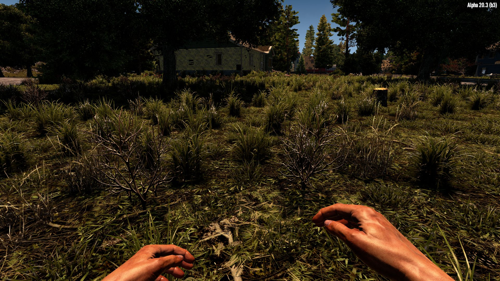

# OCB Grass Shader Modlet - 7 Days to Die Addon

Replaces original Grass Shader (Game/SwayingGrass Surface) with
a new one that supports real-time shading (e.g. point lights).
The original shader only seems to allow shadows from the main
directional light (aka the sun). Therefore this mod mostly
shines at night (pun intended). Most obvious improvements is
close to houses that have lights inside. Grass behind walls
will still be illuminated as if the wall wasn't there.

Additionally this mod also enables shadow casting for grass
if terrain quality is at least set to "high". On lowest, all
shadows (casting and receiving) are disabled. Of course this
does strain the GPU a little more, but on my machine the FPS
drop is barely noticeable (57 to 55 on GTX 1070 ti @ 2K).

It also includes a small part from my [OcbCrookedDeco][2] mod.
The grass will get more random, with varying heights, rotation
and also how many "blades" are rendered. Of course both mods
should work together without a problem.

## Changelog

### Version 0.1.2

- Automated deployment and release packaging

### Version 0.1.1

- Fix index out of bound error (@s7092910)

### Version 0.1.0

- Initial version

## Compatibility

I've developed and tested this Mod against version a20.3b3.

[1]: https://github.com/OCB7D2D/A20BepInExPreloader
[2]: https://github.com/OCB7D2D/OcbCrookedDeco
